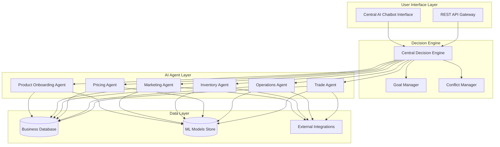

# Design Document: TAVYONIX Seller Operating System

## Overview

TAVYONIX is an AI-powered Seller Operating System that autonomously operates retail and commerce businesses for sellers in Bharat (India). The system employs a multi-agent architecture where specialized AI agents handle different business functions (marketing, inventory, pricing, operations, trade) under the coordination of a central decision engine.

The key innovation is autonomous decision-making and execution rather than providing recommendations. Sellers provide high-level business goals, and the system translates these into coordinated actions across all business functions.

## Architecture

### High-Level Architecture



### Multi-Agent Coordination Pattern

The system uses a hierarchical multi-agent architecture:

1. **Central Decision Engine**: Coordinates all agents and resolves conflicts
2. **Specialized Agents**: Handle domain-specific business functions
3. **Shared Data Layer**: Provides consistent data access across all agents
4. **Event-Driven Communication**: Agents communicate through events and message passing

## Components and Interfaces

### Central Decision Engine

**Purpose**: Coordinates all AI agents and ensures coherent business strategy execution.

**Key Responsibilities**:
- Goal decomposition and strategy planning
- Inter-agent communication and coordination
- Conflict resolution between agent recommendations
- Resource allocation and priority management
- Learning from business outcomes

**Interfaces**:
```typescript
interface DecisionEngine {
  processBusinessGoal(goal: BusinessGoal): Promise<ExecutionPlan>
  coordinateAgents(context: BusinessContext): Promise<CoordinatedActions>
  resolveConflicts(conflicts: AgentConflict[]): Promise<Resolution>
  updateStrategy(outcomes: BusinessOutcome[]): Promise<void>
}

interface BusinessGoal {
  id: string
  description: string
  metrics: GoalMetric[]
  timeframe: TimeRange
  priority: Priority
}

interface ExecutionPlan {
  strategies: Strategy[]
  agentTasks: AgentTask[]
  milestones: Milestone[]
  resourceAllocation: ResourcePlan
}
```

### Product Onboarding Agent

**Purpose**: Automatically creates product catalogs from images and basic inputs.

**Key Capabilities**:
- Computer vision for product attribute extraction
- Natural language generation for product descriptions
- SEO optimization for product listings
- Marketplace compliance validation

**Interfaces**:
```typescript
interface ProductOnboardingAgent {
  processProductImages(images: ProductImage[]): Promise<ProductAttributes>
  generateProductListing(attributes: ProductAttributes, inputs: BasicInputs): Promise<ProductListing>
  validateCompliance(listing: ProductListing, marketplaces: Marketplace[]): Promise<ComplianceReport>
  optimizeForSEO(listing: ProductListing): Promise<OptimizedListing>
}

interface ProductListing {
  title: string
  description: string
  specifications: ProductSpec[]
  images: ProcessedImage[]
  categories: Category[]
  tags: string[]
}
```

### Marketing Agent

**Purpose**: Creates and executes marketing campaigns across digital channels autonomously.

**Key Capabilities**:
- Multi-channel campaign creation
- Content generation (text, images, videos)
- Performance optimization through A/B testing
- Budget allocation and bid management
- Audience targeting and segmentation

**Interfaces**:
```typescript
interface MarketingAgent {
  createCampaigns(products: Product[], channels: DigitalChannel[]): Promise<Campaign[]>
  executeCampaigns(campaigns: Campaign[]): Promise<ExecutionResult[]>
  optimizeCampaigns(performance: CampaignMetrics[]): Promise<OptimizationActions>
  generateContent(product: Product, channel: DigitalChannel): Promise<MarketingContent>
}

interface Campaign {
  id: string
  product: Product
  channels: DigitalChannel[]
  content: MarketingContent[]
  targeting: AudienceSegment
  budget: BudgetAllocation
  schedule: CampaignSchedule
}
```

### Inventory Agent

**Purpose**: Monitors inventory levels and makes autonomous restocking decisions.

**Key Capabilities**:
- Real-time inventory tracking
- Demand forecasting using ML models
- Supplier relationship management
- Automated purchase order generation
- Seasonal and trend analysis

**Interfaces**:
```typescript
interface InventoryAgent {
  monitorInventory(): Promise<InventoryStatus[]>
  forecastDemand(product: Product, timeframe: TimeRange): Promise<DemandForecast>
  generateRestockOrders(forecasts: DemandForecast[]): Promise<PurchaseOrder[]>
  optimizeInventoryLevels(constraints: InventoryConstraints): Promise<OptimizationPlan>
}

interface InventoryStatus {
  product: Product
  currentStock: number
  reorderPoint: number
  maxStock: number
  turnoverRate: number
  forecastedDemand: number
}
```

### Pricing Agent

**Purpose**: Dynamically adjusts pricing based on market conditions and business goals.

**Key Capabilities**:
- Competitor price monitoring
- Demand-based pricing optimization
- Margin protection and profit maximization
- Promotional pricing strategies
- Market elasticity analysis

**Interfaces**:
```typescript
interface PricingAgent {
  analyzePricingOpportunity(product: Product): Promise<PricingRecommendation>
  updatePricing(recommendations: PricingRecommendation[]): Promise<PricingUpdate[]>
  monitorCompetitors(products: Product[]): Promise<CompetitorAnalysis>
  optimizeMargins(constraints: MarginConstraints): Promise<MarginOptimization>
}

interface PricingRecommendation {
  product: Product
  currentPrice: number
  recommendedPrice: number
  reasoning: PricingReason[]
  expectedImpact: PriceImpactForecast
}
```

### Operations Agent

**Purpose**: Manages order processing and fulfillment operations autonomously.

**Key Capabilities**:
- Order processing automation
- Logistics coordination
- Customer communication
- Quality control and issue resolution
- Performance optimization

**Interfaces**:
```typescript
interface OperationsAgent {
  processOrder(order: Order): Promise<FulfillmentPlan>
  coordinateLogistics(orders: Order[]): Promise<LogisticsSchedule>
  handleCustomerCommunication(events: OrderEvent[]): Promise<CommunicationAction[]>
  resolveOperationalIssues(issues: OperationalIssue[]): Promise<Resolution[]>
}

interface FulfillmentPlan {
  order: Order
  pickingInstructions: PickingInstruction[]
  packingRequirements: PackingSpec
  shippingMethod: ShippingOption
  timeline: FulfillmentTimeline
}
```

### Trade Agent

**Purpose**: Supports export and import operations for global trade expansion.

**Key Capabilities**:
- Trade opportunity identification
- Documentation and compliance management
- International market analysis
- Regulatory requirement tracking
- Cross-border logistics coordination

**Interfaces**:
```typescript
interface TradeAgent {
  identifyTradeOpportunities(products: Product[]): Promise<TradeOpportunity[]>
  manageTradeDocumentation(shipment: InternationalShipment): Promise<TradeDocuments>
  trackComplianceRequirements(markets: InternationalMarket[]): Promise<ComplianceRequirement[]>
  optimizeInternationalLogistics(orders: InternationalOrder[]): Promise<LogisticsOptimization>
}

interface TradeOpportunity {
  market: InternationalMarket
  products: Product[]
  demandForecast: number
  profitabilityAnalysis: ProfitabilityMetrics
  entryBarriers: TradeBarrier[]
  recommendedStrategy: MarketEntryStrategy
}
```

### Central AI Chatbot

**Purpose**: Provides the primary interface for business monitoring and high-level command acceptance.

**Key Capabilities**:
- Natural language understanding and generation
- Business performance monitoring and reporting
- Goal translation and strategy communication
- Conversational business intelligence
- Proactive alerting and recommendations

**Interfaces**:
```typescript
interface CentralAIChatbot {
  processUserCommand(command: string, context: ConversationContext): Promise<ChatbotResponse>
  generateBusinessReport(timeframe: TimeRange, metrics: string[]): Promise<BusinessReport>
  monitorBusinessHealth(): Promise<HealthAlert[]>
  translateGoalsToStrategy(goals: BusinessGoal[]): Promise<StrategyPlan>
}

interface ChatbotResponse {
  message: string
  actions: SystemAction[]
  followUpQuestions: string[]
  businessInsights: BusinessInsight[]
}
```

## Data Models

### Core Business Entities

```typescript
interface Seller {
  id: string
  name: string
  businessType: BusinessType
  location: Location
  goals: BusinessGoal[]
  preferences: SellerPreferences
  kycStatus: KYCStatus
}

interface Product {
  id: string
  name: string
  description: string
  specifications: ProductSpec[]
  images: ProductImage[]
  categories: Category[]
  pricing: PricingInfo
  inventory: InventoryInfo
  marketplaces: MarketplacePresence[]
}

interface BusinessMetrics {
  revenue: RevenueMetrics
  orders: OrderMetrics
  inventory: InventoryMetrics
  marketing: MarketingMetrics
  operations: OperationalMetrics
  profitability: ProfitabilityMetrics
}

interface AgentDecision {
  agentId: string
  timestamp: Date
  decisionType: DecisionType
  context: DecisionContext
  reasoning: string[]
  actions: Action[]
  expectedOutcome: OutcomeExpectation
}
```

### Integration Data Models

```typescript
interface ExternalIntegration {
  id: string
  type: IntegrationType
  provider: string
  credentials: EncryptedCredentials
  configuration: IntegrationConfig
  status: IntegrationStatus
}

interface MarketplaceIntegration extends ExternalIntegration {
  marketplace: Marketplace
  listingSync: SyncConfiguration
  orderSync: SyncConfiguration
  inventorySync: SyncConfiguration
}

interface LogisticsIntegration extends ExternalIntegration {
  provider: LogisticsProvider
  serviceTypes: ShippingService[]
  coverageAreas: GeographicArea[]
  pricingStructure: LogisticsPricing
}
```

## Error Handling

### Agent-Level Error Handling

Each AI agent implements robust error handling:

1. **Graceful Degradation**: When external services fail, agents fall back to cached data or simplified decision-making
2. **Retry Logic**: Transient failures are handled with exponential backoff retry mechanisms
3. **Circuit Breakers**: Prevent cascading failures by temporarily disabling failing integrations
4. **Fallback Strategies**: Each agent has predefined fallback strategies for common failure scenarios

### System-Level Error Handling

The Decision Engine coordinates error handling across agents:

1. **Error Propagation**: Critical errors are escalated to the Decision Engine for system-wide coordination
2. **Compensation Actions**: When one agent fails, other agents may need to adjust their strategies
3. **Human Escalation**: Complex errors that cannot be resolved autonomously are escalated to sellers
4. **Learning from Failures**: Error patterns are analyzed to improve future decision-making

### Data Consistency and Recovery

1. **Event Sourcing**: All agent decisions and actions are logged as events for audit and recovery
2. **Distributed Transactions**: Critical business operations use distributed transaction patterns
3. **Data Backup and Recovery**: Regular backups with point-in-time recovery capabilities
4. **Conflict Resolution**: Automated resolution of data conflicts between agents

## Testing Strategy

### Dual Testing Approach

The system requires both unit testing and property-based testing to ensure correctness:

**Unit Testing Focus**:
- Individual agent functionality and decision logic
- Integration points between agents and external services
- Error handling and edge cases
- API endpoint validation
- Database operations and data consistency

**Property-Based Testing Focus**:
- Universal properties that must hold across all business operations
- Agent coordination and decision consistency
- Business rule compliance across different scenarios
- System behavior under various load conditions
- Data integrity across agent interactions

### Property-Based Testing Configuration

- **Testing Framework**: Use Hypothesis (Python) or fast-check (TypeScript) for property-based testing
- **Test Iterations**: Minimum 100 iterations per property test to ensure comprehensive coverage
- **Test Tagging**: Each property test tagged with format: **Feature: tavyonix-seller-os, Property {number}: {property_text}**
- **Integration with CI/CD**: Property tests run on every commit and deployment

### Testing Infrastructure

- **Test Data Generation**: Automated generation of realistic business scenarios and data
- **Mock External Services**: Comprehensive mocking of marketplace APIs, logistics providers, and payment systems
- **Performance Testing**: Load testing for multi-agent coordination under high transaction volumes
- **Security Testing**: Penetration testing and vulnerability assessment for business data protection

## Correctness Properties

*A property is a characteristic or behavior that should hold true across all valid executions of a system—essentially, a formal statement about what the system should do. Properties serve as the bridge between human-readable specifications and machine-verifiable correctness guarantees.*

Based on the prework analysis, I've identified several categories of properties that can be consolidated to eliminate redundancy while maintaining comprehensive coverage:

### Property Reflection

After analyzing all 50 acceptance criteria, I identified several areas where properties can be consolidated:

1. **Agent Coordination Properties**: Multiple criteria about inter-agent communication can be combined into comprehensive coordination properties
2. **Continuous Monitoring Properties**: Several agents have similar monitoring requirements that can be unified
3. **Automatic Processing Properties**: Many agents have similar automatic processing behaviors that can be consolidated
4. **Data Consistency Properties**: Multiple criteria about data sharing and consistency can be combined

### Core Correctness Properties

**Property 1: Product Onboarding Completeness**
*For any* product images and basic inputs provided by a seller, the Product_Onboarding_Agent should always generate complete product listings with all required attributes, SEO-optimized content, and marketplace compliance validation
**Validates: Requirements 1.1, 1.2, 1.3, 1.5**

**Property 2: Product Onboarding Error Handling**
*For any* unclear or insufficient product images, the Product_Onboarding_Agent should always request specific additional information rather than proceeding with incomplete data
**Validates: Requirements 1.4**

**Property 3: Autonomous Marketing Execution**
*For any* onboarded product, the Marketing_Agent should automatically create and execute marketing campaigns across relevant digital channels without requiring seller approval
**Validates: Requirements 2.1, 2.2**

**Property 4: Marketing Optimization and Coordination**
*For any* campaign performance data or pricing changes, the Marketing_Agent should always optimize campaigns and maintain consistency with current pricing strategies across all channels
**Validates: Requirements 2.3, 2.4, 2.5**

**Property 5: Inventory Monitoring and Restocking**
*For any* product in the system, the Inventory_Agent should continuously monitor inventory levels and automatically initiate restocking when thresholds are reached, using demand predictions and supplier coordination
**Validates: Requirements 3.1, 3.2, 3.3, 3.4, 3.5**

**Property 6: Dynamic Pricing Optimization**
*For any* market condition changes or promotional opportunities, the Pricing_Agent should automatically adjust prices while maintaining minimum profit margins and ensuring consistency across all marketing channels
**Validates: Requirements 4.1, 4.2, 4.3, 4.4, 4.5**

**Property 7: Autonomous Operations Management**
*For any* received order, the Operations_Agent should automatically process it through fulfillment workflows, coordinate logistics, maintain tracking and communication, and resolve issues autonomously or escalate appropriately
**Validates: Requirements 5.1, 5.2, 5.3, 5.4, 5.5**

**Property 8: Trade Opportunity Management**
*For any* seller's products, the Trade_Agent should continuously monitor trade opportunities, provide timely reminders for deadlines, assist with documentation, and coordinate with other agents to ensure international market compliance
**Validates: Requirements 6.1, 6.2, 6.3, 6.4, 6.5**

**Property 9: Central AI Business Monitoring**
*For any* business performance metrics or seller commands, the Central_AI_Chatbot should continuously monitor all operational areas, alert on deviations, translate goals into actionable strategies, and provide real-time insights while maintaining conversation context
**Validates: Requirements 7.1, 7.2, 7.3, 7.4, 7.5**

**Property 10: Multi-Agent Coordination**
*For any* agent decisions that affect other business areas, the Decision_Engine should facilitate inter-agent communication, resolve conflicts based on business optimization, prioritize actions according to goals and constraints, and learn from outcomes to improve future decisions
**Validates: Requirements 8.1, 8.2, 8.3, 8.4, 8.5**

**Property 11: Goal-Based Autonomous Operation**
*For any* business goals defined by sellers, the TAVYONIX_System should automatically create and execute strategies, operate without manual intervention for routine decisions, adjust strategies based on progress, provide regular updates, and recommend goal modifications when appropriate
**Validates: Requirements 9.1, 9.2, 9.3, 9.4, 9.5**

**Property 12: Unified Platform Data Consistency**
*For any* data generated by business functions, the TAVYONIX_System should integrate all core functions, automatically share data between relevant functions, eliminate manual data transfer requirements, manage external integrations transparently, and provide a single source of truth for all business data
**Validates: Requirements 10.1, 10.2, 10.3, 10.4, 10.5**